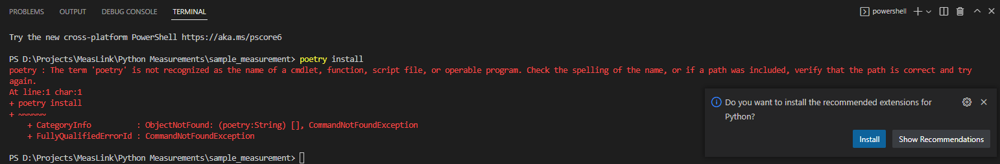

# MeasurementLink™ Support for Python

- [MeasurementLink™ Support for Python](#measurementlink--support-for-python)
  - [Introduction](#introduction)
  - [Abbreviations](#abbreviations)
  - [Dependencies](#dependencies)
  - [Examples](#examples)
    - [Setting up the Example Measurements](#setting-up-the-example-measurements)
    - [Executing the Example Measurements](#executing-the-example-measurements)
  - [Developing Measurements: Quick Start](#developing-measurements-quick-start)
    - [Installation](#installation)
    - [Developing a minimal python measurement](#developing-a-minimal-python-measurement)
  - [Steps to run/debug the measurement service](#steps-to-rundebug-the-measurement-service)
  - [Static Registration of Python Measurements](#static-registration-of-python-measurements)
    - [Create a batch file that runs a python measurement](#create-a-batch-file-that-runs-a-python-measurement)
    - [Create Executable for Python Scripts](#create-executable-for-python-scripts)
  - [API References](#api-references)
  - [Appendix: Managing Measurement as Python Package(Project)](#appendix-managing-measurement-as-python-packageproject)
    - [Create and Manage Python Measurement Package using poetry](#create-and-manage-python-measurement-package-using-poetry)
    - [Create and Manage Python Measurement Package using venv](#create-and-manage-python-measurement-package-using-venv)
    - [Create and Manage Python Measurement Package by directly installing `ni-measurementlink-service` as a system-level package](#create-and-manage-python-measurement-package-by-directly-installing-ni-measurementlink-service-as-a-system-level-package)

---

## Introduction

MeasurementLink Support for Python (`ni-measurementlink-service`) is a python framework that enables measurement developers to quickly create python measurements and run them as a service (gRPC).

---

## Dependencies

- Python >= 3.8 [(3.9 recommended)](https://www.python.org/downloads/release/python-3913/)
- [grpcio >= 1.49.1, < 2.x](https://pypi.org/project/grpcio/1.49.1/)
- [protobuf >= 4.21, < 5.x](https://pypi.org/project/protobuf/4.21.0/)
- [pywin32 >= 303 (Only for Windows)](https://pypi.org/project/pywin32/303/)

---

## Examples

The `examples` directory contains the following example projects:  

1. `sample_measurement`: Performs a loopback measurement with various data types.
2. `nidaqmx_analog_input`: Performs a finite analog input measurement with NI-DAQmx.
3. `nidcpower_source_dc_voltage`: Sources and measures a DC voltage with an NI SMU. Provides a Measurement UI
4. `nidcpower_source_dc_voltage_with_labview_ui`: Sources and measures a DC voltage with an NI SMU. Provides a LabVIEW UI
5. `nidmm_measurement`: Performs a measurement using an NI DMM.
6. `nifgen_standard_function`: Generates a standard function waveform using an NI waveform generator.
7. `niscope_acquire_waveform`: Acquires a waveform using an NI oscilloscope.
8. `niswitch_control_relays`: Controls relays using an NI relay driver (e.g. PXI-2567).

### Setting up the Example Measurements

The example measurements shared are *poetry-based* projects. Follow the below steps to  for setting up the example measurement:

1. Install `poetry`. Refer to <https://python-poetry.org/docs/#installation> for information on installing poetry.

2. Open a command prompt, and change the working directory to the directory of the example measurement you want to work with.

    ``` cmd
    cd <path_of_example_measurement>
    REM Example: cd "..\measurementlink-python\examples\dc_measurement"
    ```

3. Run `poetry install`. This command creates/updates the .venv and installs all the dependencies(including `ni-measurementlink-service` package) needed for the Example into `.venv`

    ``` cmd
    poetry install
    ```
    - If you get a "command not found" error during `poetry install`, make sure that you added the Poetry path to the system path. Refer to [https://python-poetry.org/docs/#installing-with-the-official-installer/Add-poetry-to-your-path](https://python-poetry.org/docs/#installing-with-the-official-installer:~:text=Add%20Poetry%20to%20your%20PATH)
    

### Executing the Example Measurements

1. Start the discovery service if not already started.
2. Use `poetry run` to run the measurement service:

    ``` cmd
    poetry run python measurement.py
    ```

---

## Developing Measurements: Quick Start

This section provides instructions to develop custom measurement services in Python using MeasurementLink Support for Python.

### Installation

Make sure the system has the recommended python version is installed. Install MeasurementLink Support for Python using [pip](https://pip.pypa.io/).

``` cmd
REM Activate the required virtual environment if any.
pip install ni-measurementlink-service
```

Check if you have installed the expected version of MeasurementLink Support for Python installed by running the below command:

```cmd
pip show ni-measurementlink-service
```

### Developing a minimal python measurement

1. Install the `ni-measurementlink-generator` package.

``` cmd
REM Activate the required virtual environment if any.
pip install ni-measurementlink-generator
```

2. Run the `ni-measurementlink-generator` tool. Use command line arguments to specify the `display-name` and optionally the `version`, `measurement-type`, and `product-type`.

    1. Running `ni-measurementlink-generator` without optional arguments:

    `ni-measurementlink-generator SampleMeasurement`

    'SampleMeasurement' is the display name of your measurement service. Without the optional arguments,
    the other arguments are generated for you based on the display name.

    2. Running `ni-measurementlink-generator` with optional arguments for `measurement-version`, `ui-file`,
    `service-class`, and `description-url`:

    `ni-measurementlink-generator SampleMeasurement --measurement-version 0.1.0.0 --ui-file MeasurementUI.measui --service-class SampleMeasurement_Python --description-url https://www.example.com/SampleMeasurement.html`

    3. Running `ni-measurementlink-generator` with optional argument for `directory-out`

    `ni-measurementlink-generator SampleMeasurement --directory-out <new_path_for_created_files>`

    If no output directory is specified, the files will
    be placed in a new folder under the current directory
    named after the display name without spaces.

3. To customize the created measurement, provide metadata of the measurement's configuration(input parameters) and outputs(output parameters) in `measurement.py`.
    1. Use the `configuration()` decorator to provide metadata about the configurations.**The order of the configuration decorator must match with the order of the parameters defined in the function signature.**

        ``` python
        @foo_measurement_service.register_measurement
        #Display Names can not contains backslash or front slash.
        @foo_measurement_service.configuration("DisplayNameForInput1", DataType.String, "DefaultValueForInput1")
        @foo_measurement_service.configuration("DisplayNameForInput2", DataType.String, "DefaultValueForInput2")
        def measure(input_1, input_2):
            ''' A simple Measurement method'''
            return ["foo", "bar"]
        ```

    2. Use the `output()` decorator to provide metadata about the output.**The order of the output decorators from top to bottom must match the order of the values of the list returned by the function.**

        ``` python
        @foo_measurement_service.register_measurement
        @foo_measurement_service.configuration("DisplayNameForInput1", nims.DataType.String, "DefaultValueForInput1")
        @foo_measurement_service.configuration("DisplayNameForInput2", nims.DataType.String, "DefaultValueForInput2")
        @foo_measurement_service.output("DisplayNameForOutput1", nims.DataType.String)
        @foo_measurement_service.output("DisplayNameForOutput2", nims.DataType.String)
        def measure(input_1, input_2):
            return ["foo", "bar"]
        ```

4. Run/Debug the created measurement by following the steps discussed in the section ["Steps to run/debug the measurement service".](#steps-to-rundebug-the-measurement-service)

---

## Steps to run/debug the measurement service

1. Start the discovery service if not already started.

2. (Optional)Activate related virtual environments. Measurement developers can skip this step if they are not using any [virtual environments](#create-and-manage-python-measurement-package-using-venv) or [poetry-based projects.](#create-and-manage-python-measurement-package-using-poetry)

    ```cmd
    .venv\scripts\activate
    ```

    - After successful activation, you can see the name of the environment, `(.venv)` is added to the command prompt.
    - If you face an access issue when trying to activate, retry after allowing scripts to run as Administrator by executing the below command in Windows PowerShell:

        ```cmd
        Set-ExecutionPolicy RemoteSigned 
        ```

3. [Run](https://code.visualstudio.com/docs/python/python-tutorial#_run-hello-world)/[Debug](https://code.visualstudio.com/docs/python/debugging#_basic-debugging) the measurement python file.

4. To stop the running measurement service, press `Enter` in the terminal to properly close the service.

5. (Optional)After the usage of measurement, deactivate the virtual environment. Measurement developers can skip this step if they are not using any [virtual environments](#create-and-manage-python-measurement-package-using-venv) or [poetry-based projects.](#create-and-manage-python-measurement-package-using-poetry)

    ```cmd
    deactivate
    ```

---

## Static Registration of Python Measurements

Refer to the [Static Registration of measurements section]() for the detailed steps needed to statically register a measurement.

To Statically register the examples provided, the user can copy the example directory with the service config file with the startup batch file, to the search paths and follow the [Setting up the Example Measurements](#setting-up-the-example-measurements) section to set up the measurements.

Note: The startup batch file can be modified accordingly if the user wants to run with a custom python distribution or virtual environment

### Create a batch file that runs a python measurement

The batch file used for static registration is responsible for starting the Python Scripts.

Typical Batch File:

``` cmd
"<path_to_python_exe>" "<path_to_measurement_file>"
```

Examples to start the fictitious file named `foo_measurement.py`:

1. Using the Python system distribution

    ```cmd
    python foo_measurement.py
    ```

2. Using the virtual environment

    ```cmd
    REM Windows
    .\.venv\Scripts\python.exe foo_measurement.py

    REM Linux 
    .venv/bin/python foo_measurement.py
    ```

### Create Executable for Python Scripts

To create an executable from a measurement, measurement authors can use the [pyinstaller](https://www.pyinstaller.org/) tooling. During the executable creation, the user can also embed the User Interface file using the `--add-data "<path_of_the_UI_File>;."`.

Typical Pyinstaller command to build executable.

```cmd
pyinstaller --onefile --console --add-data "<path_of_the_UI_File>;." --paths .venv\Lib\site-packages\ <path_of_the_measurement_script>
```

## API References

[Click here](https://ni.github.io/measurementlink-python/) to view the API reference documentation.

## Appendix: Managing Measurement as Python Package(Project)

Measurement and its related files can be maintained as a python package. The basic components of any Python Measurement Package are:

1. Measurement Python Module(.py file)
    - This file contains all the details related to the measurement and also contains the logic for the measurement execution.
    - This file is run to start the measurement as a service.

2. UI File
    - UI file for the Measurement. Types of supported UI files are:
        - Measurement UI(.measui): created using the **Measurement UI Editor application**.
        - LabVIEW UI(.vi)
    - The path of this file is configured by `ui_file_path` in `measurement_info` variable definition in Measurement Python Module(.py file).

Python communities have different ways of managing a python package and its dependencies. It is up to the measurement developer, on how they wanted to maintain the package and dependencies. Measurement developers can choose from a few common approaches discussed below based on their requirements.

Note: Once we have the template support for Python measurement, the approach to managing the python measurement package(project) will be streamlined and simplified.

### Create and Manage Python Measurement Package using poetry

1. Setting up Poetry(One-time setup)
    1. Make sure the system has the recommended python version installed.

    2. Install the `poetry` using the installation steps given in <https://python-poetry.org/docs/#installation>.

2. Create a new python project and add `ni-measurementlink-service` as a dependency to the project.

    1. Open a command prompt, and change the working directory to the directory of your choice where you want to create the project.

        ``` cmd
        cd <path_of_directory_of_your_choice>
        ```

    2. Create a python package(project) using the poetry new command. Poetry will create boilerplate files and folders that are commonly needed for a python project.

        ``` cmd
        poetry new <name_of_the_project>
        ```

    3. Add the `ni-measurementlink-service` package as a dependency using the [poetry add command](https://python-poetry.org/docs/cli/#add).

        ``` cmd
        cd <name_of_the_project>
        poetry add ni-measurementlink-service
        ```

    4. The virtual environment will be auto-created by poetry.

    5. Create measurement modules as described in ["Developing a minimal python measurement"](#developing-a-minimal-python-measurement)
        - Any additional dependencies required by measurement can be added using [add command](https://python-poetry.org/docs/cli/#add).

            ``` cmd
            poetry add <dependency_package_name>
            ```

For detailed info on managing projects using poetry [refer to the official documentation](https://python-poetry.org/docs/cli/).

### Create and Manage Python Measurement Package using venv

1. Make sure the system has the recommended python version installed.

2. Open a command prompt, and change the working directory to the directory of your choice where you want to create a project.

    ``` cmd
    cd <path_of_directory_of_your_choice>
    ```

3. Create a virtual environment.

    ``` cmd
    REM This creates a virtual environment named .venv
    python -m venv .venv
    ```

4. Activate the virtual environment. After successful activation

    ``` cmd
    .venv\scripts\activate
    REM Optionally upgrade the pip within the venv by executing the command
    python -m pip install -U pip
    ```

5. Install the `ni-measurementlink-service` package into the virtual environment.

    ``` cmd
    pip install ni-measurementlink-service
    ```

6. Create measurement modules as described in ["Developing a minimal python measurement"](#developing-a-minimal-python-measurement)
    - Any additional dependencies required by measurement can be added pip install.

        ``` cmd
        pip install <dependency_package_name>
        ```

For detailed info on managing projects with a virtual environment [refer to the official documentation](https://docs.python.org/3/tutorial/venv.html).

### Create and Manage Python Measurement Package by directly installing `ni-measurementlink-service` as a system-level package

Measurement developers can also install `ni-measurementlink-service` as a system package if necessary.

1. Install the `ni-measurementlink-service` package from the command prompt

    ``` cmd
    pip install ni-measurementlink-service
    ```

2. Create measurement modules as described in ["Developing a minimal python measurement"](#developing-a-minimal-python-measurement)

---
