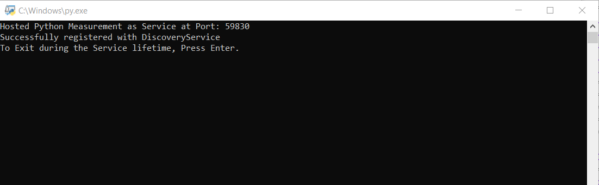

# Measurement Services Support for Python

This repo contains the necessary Python Measurement templates and examples to call into the Measurement Services.

Recommended Python Version: 3.8

## Examples

### DC Measurement

DC Measurement is a simple python based example that interacts with DCPower 4145 Instrument.

#### Steps to run the dc_measurement

1. **Setting up python and the virtual environment with required dependency.** This step is only for first-time users.

    1. Make sure the system has the recommended python version installed.

    2. Open a Command prompt and change the working directory to `..\examples\dc_measurement`

    3. Create a Virtual Environment.
        - Command: `python -m venv venv`. This creates a virtual environment named venv

    4. Activate the Virtual Environment.
        - Command : `venv\scripts\activate.bat`.
        - After successful activation, you can see the name of the environment, here `(venv)` tag, added to the command prompt.

    5. Installing all the requirements.
        - Command: `pip install -r requirements.txt`
        - This installs all the requirements for dc_measurement to the active virtual environment.
2. Start the discovery service if not already started. As of Jan 2022, Discovery Service will be auto-started only if you are working with a screen file-based measurement plugin.

3. Make sure the resource name of the available DCPower 4145 is the same as the string value set for the `RESOURCE_NAME` constant in the metadata.py.

4. Run the \_\_main\_\_.py from the dc_measurement directory. You will see a window similar to the image below. The Port number might be different in your case. Now the measurement is ready for interaction from clients.

#### Overview on the Components of dc_measurement

1. \_\_main\_\_.py
    - This is the start-up file. Users can run this file to start the measurement.
    - Do not edit this file.

2. metadata.py
    - This file provides information about the measurement. For instance, The python file that holds the measurement method is configured here.
    - Do not edit the name of this file.
    - The **Value** of Constants within the file is user-editable. Do not rename/remove the constants.

3. measurement.py
    - This file's name is user-configurable. The file name should match with the `MEASUREMENT_MODULE_NAME` configured in metadata.py.
    - This file contains the measurement method. The Measurement method name by default is `measure`. This method name is also user-configurable. The Method name should match with the `MEASUREMENT_METHOD_NAME` configured in metadata.py
        - The output of the measurement method should be a tuple of double(as of Jan 2022) and the name of each output in the tuple is correspondingly configured via `MEASUREMENT_OUTPUTS` in metadata.py. These output names are used to display back the outputs in the UI.

4. DCMeasurementScreen.isscr
    - UI file for the Measurement.
    - The Name of this file is configured by `SCREEN_FILE_NAME` in metadata.py

## Template

Template support is coming soon. :)
