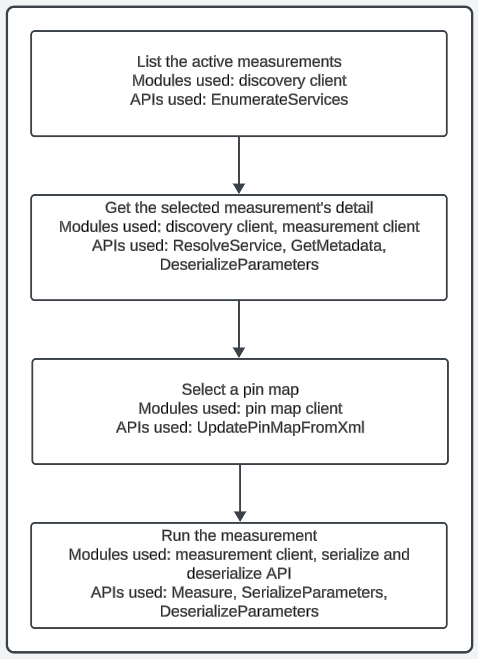

# Python Script to Run Measurements

## Problem Statement

- Currently, the users can run LabVIEW and Python measurements from InstrumentStudio and TestStand.
- If the user wants to run measurements, the user should
  - Create gRPC client stubs for the proto files for the required MeasurementLink services
  - Create proto files and its corresponding gRPC client stubs for the measurement to be executed
  - Based on the stubs, create client modules to interact with the respective services
- To perform all the above-mentioned workflow the user should have,
  - Expertise in Python
  - Working knowledge in gRPC
  - Good understanding of MeasurementLink

## Proposed Solution

- We have some modular libraries in the Python client repository which could be used for writing
  Python scripts to run measurements.
- The user need not have to create or use any proto files as they can benefit from the existing
  libraries which extracts the need to know about gRPC and MeasurementLink.

## Implementation

  

## Modules Used

- Discovery client
- Serialize and Deserialize API

## Modules Newly Implemented

- Measurement client
- Pin map client
- Added a `EnumerateServices` API in discovery client
